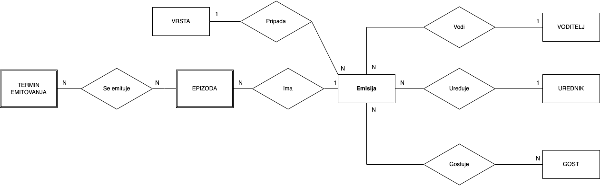
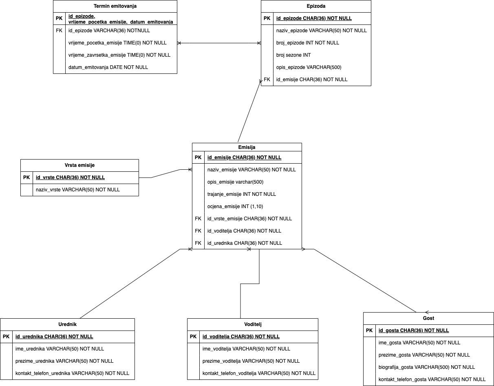

# process-information-systems
# TV Program Database Schema

This repository implements a database schema for managing a TV program. The database includes tables for TV shows, genres, episodes, editors, hosts, guests, and the date and time of each show. The project provides SQL scripts for database creation, tables creation, and data seed with test data. Additionally, it includes a changelog file for the Liquibase application to manage database migrations and Docker files for running the application.

## ER Model Diagram



## Database Schema


## Prerequisite
Before you begin, ensure you have met the following requirements:
- You have installed the latest version of [Docker](https://docs.docker.com/get-docker/).

## Running the Application
1. Clone the repository
2. Navigate to the repository folder
3.
#### Option 1
### Using docker-compose (the easiest way):
1. Run `docker-compose up -d` 

or

1. Run `docker-compose up postgres_db -d`
2. Run `docker-compose up liquibase`


#### Option 2
### Migration run and setup:
1. Install Liquibase (version `4.21.0`): https://docs.liquibase.com/start/install/liquibase-macos.html
2. Run the following command:
```shell
liquibase --search-path=./liquibase --logLevel=DEBUG update --url="jdbc:postgresql://localhost:5432/postgres?currentSchema=public" --changelog-file=changelog/changelog.json --username=admin --password=admin
```
OR JUST USE THE `run-migrations.sh` script in the `scripts` directory.


#### Option 3
### Migrations using a docker image and container:
1. In the root of the project run:
```shell 
docker build . -t liquibase --progress=plain --no-cache=true
```
2. Run:
```shell
docker run --network=NETWORK_NAME_OR_ID liquibase
```

To know about the network you need to use in the previous command (`--network`):
You can use the following steps to find out the network on which your DB container is running and then run the Liquibase container on the same network.
1. List all running Docker containers: `docker ps`
2. Use the Database container ID: `docker inspect CONTAINER_ID_OR_NAME`
3. Network ID and/or name will be located under the `"Networks"` section. And use that ID/Name to run the migrations using a docker image.

NOTE: The `docker-compose` file in the `root` directory can also be used for running migrations separately with: `docker-compose up --build liquibase`

The TV program database will be accessible on `localhost` using the specified port 5432.